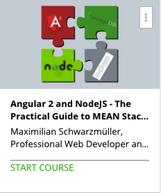

```
Roberto Nogueira  BSd EE, MSd CE
Solution Integrator Experienced - Certified by Ericsson
```

# Angular2 and Node.js



**Create modern, scalable and high-speed Web Applications with Angular 2 and NodeJS**

Angular 1 and NodeJS, together with ExpressJS (NodeJS Framework) and MongoDB formed the very popular MEAN stack. Now is the time to dive into MEAN 2.0 and replace Angular 1 with Angular 2.

Benefit from the many improvements and advantages Angular 2 offers you: Speed, ease of development, highly reactive, awesome support for asynchronous operations, great scalability and more!
And combine these advantages with the power of a NodeJS backend!

**Learn or refresh the Angular 2 Basics!**

This course is no Angular 2 course, but it includes detailed explanation of the core concepts used as well as about Angular 2 in general. However, keep in mind that, as this course is no Angular 2 course, having other resources at hand is recommended.

**Specifically, you will learn how to:**

* Set up a NodeJS + Express + MongoDB + Angular 2 Application
* Use NodeJS and Express efficiently
* Build reusable Components in Angular 2 and create a reactive User Experience with the Tools provided by Angular 2
* Connect your NodeJS (or any other language!) backend with your Angular 2 App through * Angular 2’s Http Service
* Provide appropriate endpoints on your Backend, for your Frontend to consume
* Make your Application more secure by implementing Users and Authentication as well as Authorization
* Handle Errors gracefully
* And much more...!

## Contents

```
[ ] Section: 1 Getting Started
	[ ] 1. Introduction 2:02
	[ ] 2. Refresher: What is NodeJS? 2:04
	[ ] 3. Refresher: What is Angular 2? 1:14
	[ ] 4. How do NodeJS and Angular 2 work together? 3:27
	[ ] 5. Update to Angular 2 Release Candidate 2:40
[ ] Section: 2 Backend and Project Setup & NodeJS Refresher
[ ] Section: 3 Data Storage with MongoDB (NoSQL Database)
[ ] Section: 4 Creating the Frontend with Angular 2 (includes Angular 2 Refreshers)
[ ] Section: 5 Connecting the Angular 2 Frontend with the NodeJS Backend
[ ] Section: 6 Users and Authentication
[ ] Section: 7 Error Handling
[ ] Section: 8 Update to Angular 2 Release Candidate
[ ] Section: 9 Creating your own Workspace / Seed Project
[ ] Section: 10 Deployment
```
